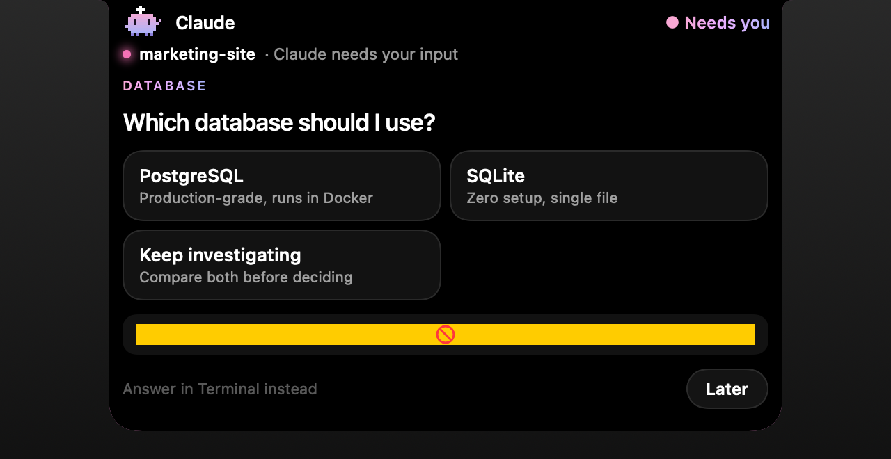
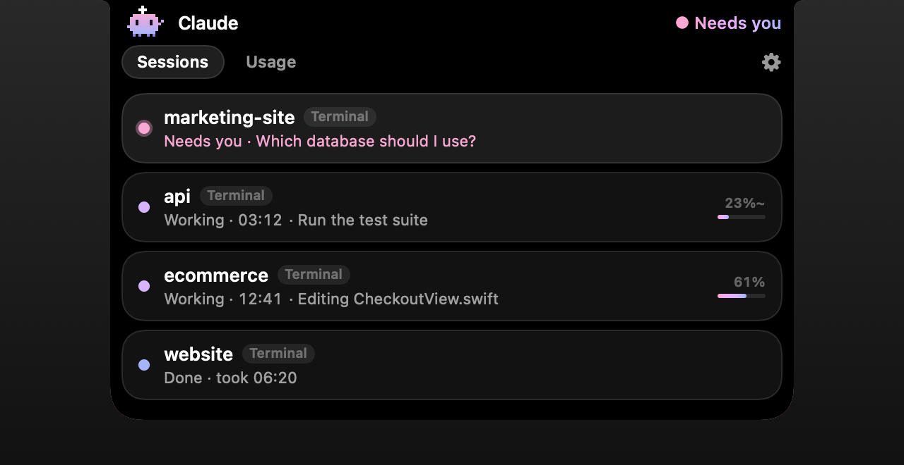
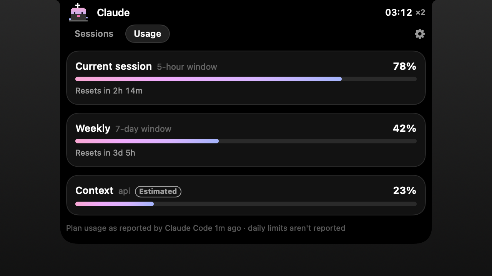

# Claude Notch

**Go do something else. The notch tells you when Claude needs you.**

Claude Notch is a small, local-first macOS companion for Claude Code. A little pixel critter lives in your Mac's notch:

- It types away while Claude works, with a timer showing how long.
- It waves when Claude has a question. You can answer right there, without going back to Terminal.
- It celebrates when a meaningful task finishes.

Click the notch to see all your sessions and your plan usage.

No account. No server. No analytics. Nothing leaves your Mac.

| Working | Claude needs you | Sessions | Usage |
|---|---|---|---|
|  |  |  |  |

## Install

Requires macOS 14+ on Apple Silicon.

**Download:** grab `Claude-Notch.zip` from the [latest release](../../releases/latest), unzip it, and move **Claude Notch** to Applications. The app isn't notarized by Apple yet, so the first time you open it, go to **System Settings → Privacy & Security** and click **Open Anyway**.

**Or build it yourself.** The Command Line Tools are enough (`xcode-select --install`):

```bash
./scripts/build-app.sh --install
```

That installs to `/Applications`, or to `~/Applications` if you don't have admin rights, and opens the app.

On first launch, the notch asks to **Connect Claude Code**. That adds a few hooks to `~/.claude/settings.json`. The original file is backed up once to `settings.json.claude-notch-backup`, and **Disconnect** in the menu bar removes them. Restart any Claude Code sessions that were already open.

Want to see it without a real session? Choose **Show me a demo** at the end of onboarding.

## What works where

| | Terminal (`claude`) | Claude desktop app | IDE extensions |
|---|---|---|---|
| Working / Needs you / Done, timer, activity | ✓ | ✓ | ✓ |
| Answer questions from the notch | ✓ (falls back to Terminal after 2 min) | Notified; answer in the app | Notified; answer in the IDE |
| Permission prompts | Notified; approve in Terminal | Notified | Notified |
| Plan usage (5-hour / weekly) | ✓ Pro/Max, via status line | Unavailable | Unavailable |
| Context usage | ✓ (verified) | Estimated | Estimated |

Why the difference? In Terminal, the notch can hold a question open and answer it cleanly. The desktop app and IDEs show their own question UI, and holding it would make them look frozen, so there the notch alerts you and takes you to the right window instead.

## Develop

```bash
swift build
```

```bash
./scripts/test.sh
```

```bash
.build/debug/ClaudeNotch --snapshot docs/screenshots
```

`swift build` builds everything and `./scripts/test.sh` runs the unit and integration tests. The `--snapshot` command renders every notch state to PNG.

Isolate a dev instance from your real one by giving it its own folder for the socket, state and config:

```bash
CLAUDE_NOTCH_HOME=/tmp/cn-dev .build/debug/ClaudeNotch
```

### Releases, website and CI

| Workflow | Trigger | What it does |
|---|---|---|
| `ci.yml` | every push / PR | Builds, runs the tests, renders every notch state, and uploads the screenshots plus an app build as artifacts |
| `release.yml` | publishing a release on github.com, or pushing a `v*` tag | Builds and attaches `Claude-Notch.zip` to the release |

**Website:** `site/` is a static site deployed on Vercel (`vercel.json` points Vercel at it; no build step). Its download buttons always point at the latest release's `Claude-Notch.zip`.

- [docs/architecture.md](docs/architecture.md): modules, boundaries, decisions.
- [docs/technical-discovery.md](docs/technical-discovery.md): what Claude Code exposes, what's verified, and what's still open.

## Privacy & security

- **Local only:** the app talks to its hook helper over a Unix socket that only your user can open. No network code.
- **Never stored or shown:** prompts, code, and shell command text. Activity lines use file names and the tool's own description.
- **Permission prompts:** the notch never approves them. It sends you to Terminal.
- **Logging:** diagnostic logging is off by default. See [SECURITY.md](SECURITY.md).

## Mascot & branding

The critter is original pixel art drawn in code (`apps/macos/Mascot.swift`), behind a `MascotRenderer` protocol so the art can be swapped.

This project is not affiliated with or endorsed by Anthropic. Review Anthropic's brand guidelines before distributing anything that uses the Claude name or artwork.

## License

MIT, see [LICENSE](LICENSE).
